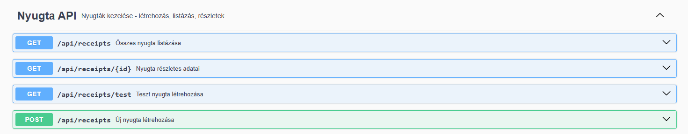
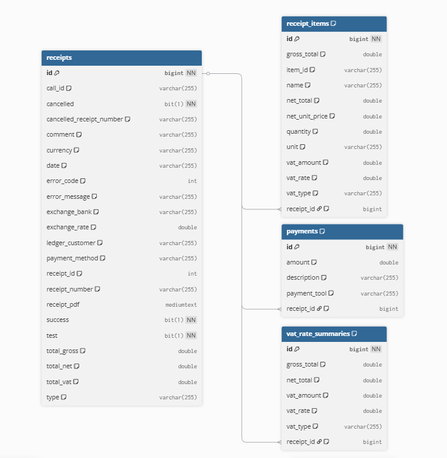

# Nyugtakezelő Alkalmazás

Spring Boot + Angular alkalmazás nyugták létrehozására és kezelésére a Számlázz.hu API-n keresztül.

## Technológiák

- **Backend:** Spring Boot 4.0.1 + MySQL
- **Frontend:** Angular 21
- **Infrastruktúra:** Docker + Docker Compose

## Gyors Indítás

1. **Környezeti változók beállítása**
   ```bash
   # Másold le a .env.example-t és állítsd be az értékeket
   cp .env.example .env
   ```
   Szerkeszd a `.env` fájlt:
   - `SZAMLAZZ_API_KEY` - A Számlázz.hu API kulcsod
   - `MYSQL_DATABASE`, `MYSQL_USER`, `MYSQL_PASSWORD` - MySQL adatbázis beállítások

2. **Indítás**
   ```bash
   docker compose up -d
   ```

3. **Elérés**
   - Frontend: http://localhost:4200
   - Backend API: http://localhost:8080
   - Swagger UI: http://localhost:8080/swagger-ui.html

## API Dokumentáció

### Swagger UI

Az összes API végpont dokumentációja interaktívan elérhető a Swagger UI-ban.



## Adatbázis Szerkezete



